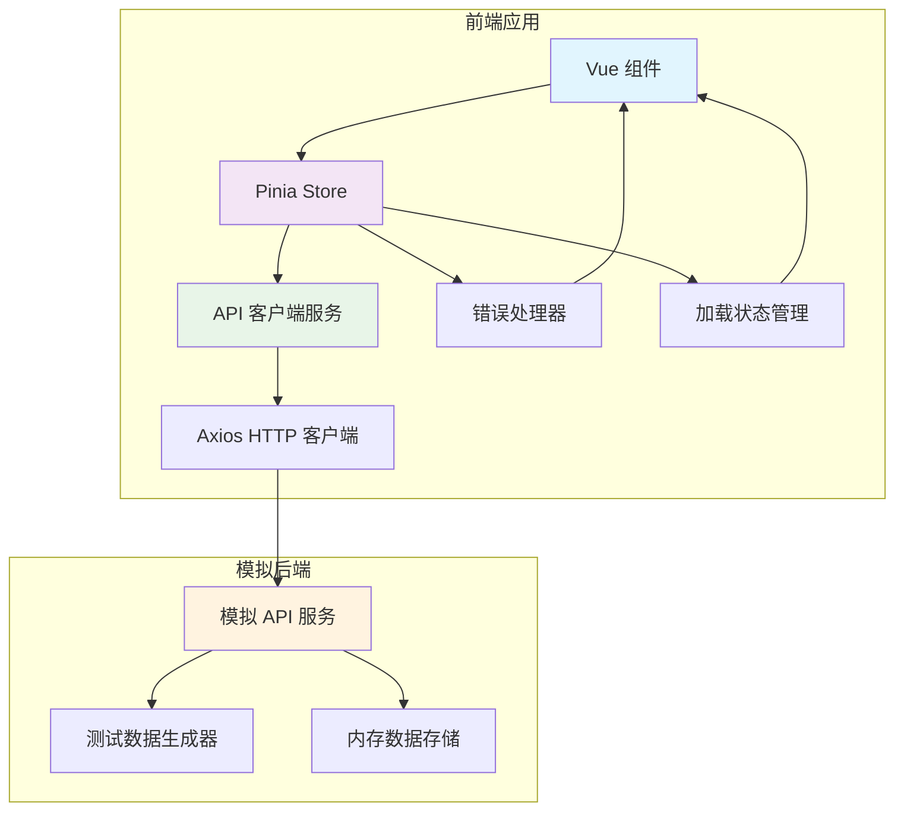
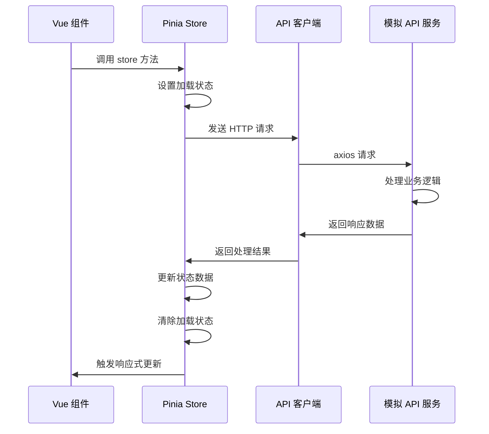
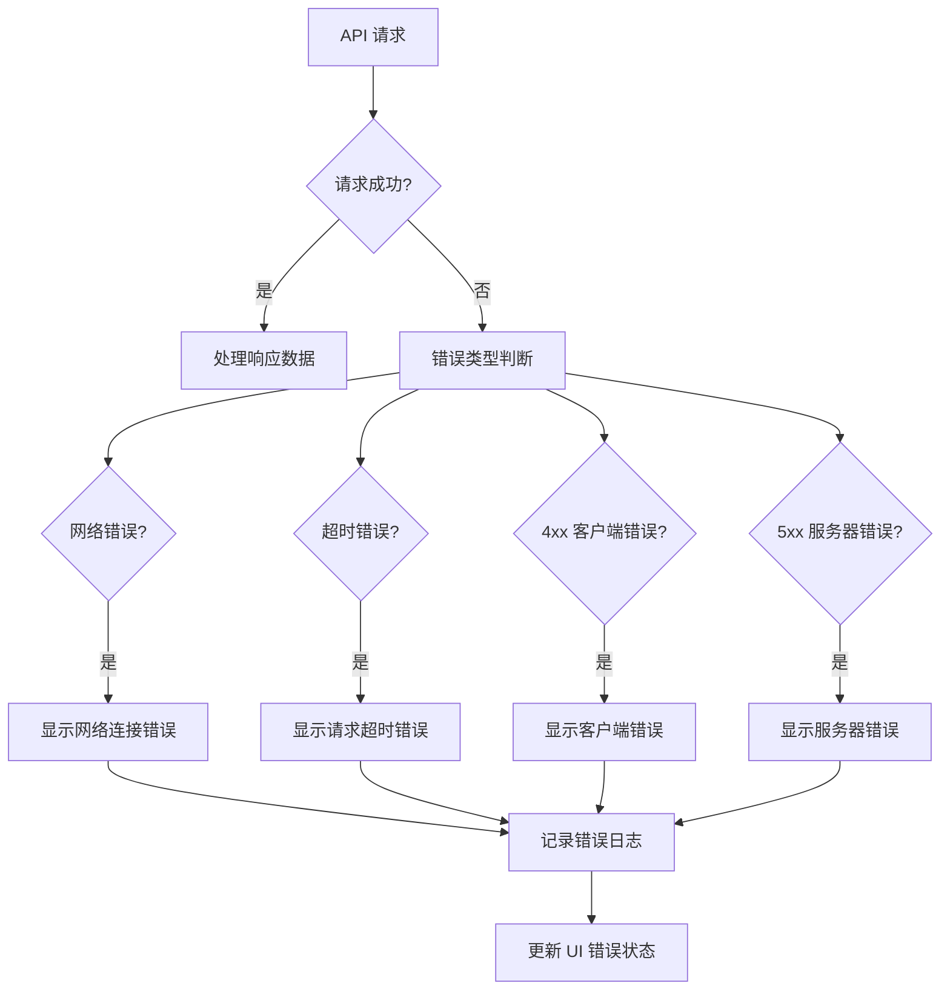
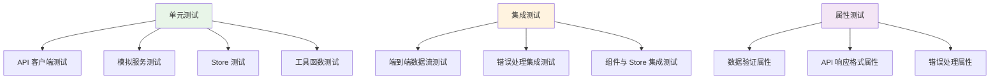

# 设计文档

## 概述

本设计文档描述了如何在现有的 Vue 3 + TypeScript + Pinia 用户管理系统中集成 axios HTTP 客户端库，并实现本地模拟 API 功能。该设计将数据持久化从 localStorage 迁移到基于 HTTP API 的架构，同时保持现有功能和用户体验不变。

设计的核心目标是：
- 引入 axios 作为 HTTP 客户端
- 实现本地模拟 API 服务提供测试数据
- 保持现有组件接口和用户体验不变
- 提供完整的错误处理和加载状态管理
- 为将来连接真实后端 API 做准备

## 架构

### 整体架构图



### 数据流架构



## 组件和接口

### API 客户端服务 (apiClient.ts)

```typescript
// API 客户端接口定义
interface ApiClient {
  // 用户相关 API
  getUsers(params?: UserQueryParams): Promise<ApiResponse<User[]>>
  getUserById(id: string): Promise<ApiResponse<User>>
  createUser(userData: CreateUserData): Promise<ApiResponse<User>>
  updateUser(id: string, userData: UpdateUserData): Promise<ApiResponse<User>>
  deleteUser(id: string): Promise<ApiResponse<void>>
}

// API 响应格式
interface ApiResponse<T> {
  data: T
  message: string
  success: boolean
  timestamp: string
}

// 查询参数
interface UserQueryParams {
  search?: string
  role?: string
  status?: string
  page?: number
  pageSize?: number
}
```

### 模拟 API 服务 (mockApiService.ts)

```typescript
// 模拟 API 服务接口
interface MockApiService {
  // 初始化服务
  initialize(): void
  
  // 用户管理端点
  handleGetUsers(params: UserQueryParams): Promise<ApiResponse<User[]>>
  handleCreateUser(userData: CreateUserData): Promise<ApiResponse<User>>
  handleUpdateUser(id: string, userData: UpdateUserData): Promise<ApiResponse<User>>
  handleDeleteUser(id: string): Promise<ApiResponse<void>>
  
  // 数据管理
  loadTestData(): void
  saveToStorage(): void
  loadFromStorage(): void
}
```

### HTTP 拦截器 (httpInterceptors.ts)

```typescript
// 请求拦截器配置
interface RequestInterceptorConfig {
  baseURL: string
  timeout: number
  headers: Record<string, string>
}

// 响应拦截器处理
interface ResponseInterceptorHandler {
  onSuccess(response: AxiosResponse): AxiosResponse
  onError(error: AxiosError): Promise<never>
}
```

### 更新后的 Pinia Store

```typescript
// 扩展现有 userStore 接口
interface UserStoreExtended extends UserStore {
  // 新增状态
  isLoading: ComputedRef<boolean>
  apiError: ComputedRef<string | null>
  
  // 新增方法
  fetchUsers(params?: UserQueryParams): Promise<void>
  refreshUser(id: string): Promise<void>
  clearError(): void
}
```

## 数据模型

### API 响应数据模型

```typescript
// 标准 API 响应格式
interface ApiResponse<T> {
  data: T                    // 实际数据
  message: string           // 响应消息
  success: boolean          // 操作是否成功
  timestamp: string         // 响应时间戳
  errors?: string[]         // 错误详情（可选）
}

// 分页响应格式
interface PaginatedResponse<T> extends ApiResponse<T[]> {
  pagination: {
    current: number         // 当前页码
    pageSize: number        // 每页大小
    total: number          // 总记录数
    totalPages: number     // 总页数
  }
}
```

### 错误响应模型

```typescript
// API 错误响应
interface ApiErrorResponse {
  success: false
  message: string
  errors: string[]
  code: string
  timestamp: string
}

// HTTP 错误类型
enum HttpErrorType {
  NETWORK_ERROR = 'NETWORK_ERROR',
  TIMEOUT_ERROR = 'TIMEOUT_ERROR',
  CLIENT_ERROR = 'CLIENT_ERROR',
  SERVER_ERROR = 'SERVER_ERROR',
  VALIDATION_ERROR = 'VALIDATION_ERROR'
}
```

### 测试数据模型

```typescript
// 测试数据配置
interface TestDataConfig {
  userCount: number         // 生成用户数量
  roles: UserRole[]        // 包含的角色类型
  statuses: UserStatus[]   // 包含的状态类型
  locales: string[]        // 支持的语言环境
}

// 测试用户生成器
interface TestUserGenerator {
  generateUsers(config: TestDataConfig): User[]
  generateChineseNames(): string[]
  generateEmailAddresses(count: number): string[]
  ensureUniqueness(users: User[]): User[]
}
```

## 错误处理

### 错误处理策略



### 错误处理实现

```typescript
// 错误处理器接口
interface ApiErrorHandler {
  handleNetworkError(error: AxiosError): void
  handleTimeoutError(error: AxiosError): void
  handleClientError(error: AxiosError): void
  handleServerError(error: AxiosError): void
  handleValidationError(error: AxiosError): void
  logError(error: Error, context: string): void
}

// 错误恢复策略
interface ErrorRecoveryStrategy {
  shouldRetry(error: AxiosError): boolean
  getRetryDelay(attemptNumber: number): number
  getMaxRetries(): number
}
```

## 测试策略

### 测试层次结构



### 测试配置

**单元测试**：
- 使用 Vitest 作为测试运行器
- 使用 @vue/test-utils 测试 Vue 组件
- 使用 axios-mock-adapter 模拟 HTTP 请求
- 测试覆盖率目标：90% 以上

**属性测试**：
- 使用 fast-check 库进行属性测试
- 最小迭代次数：100 次
- 重点测试数据验证和 API 响应格式
- 每个属性测试必须引用设计文档中的属性

**集成测试**：
- 测试完整的用户操作流程
- 验证组件与 Store 的交互
- 测试错误处理的端到端流程
- 使用真实的模拟 API 服务进行测试

## 正确性属性

*属性是一个特征或行为，应该在系统的所有有效执行中保持为真——本质上是关于系统应该做什么的正式陈述。属性作为人类可读规范和机器可验证正确性保证之间的桥梁。*

### 属性 1: API 客户端 HTTP 方法支持
*对于任何* HTTP 方法（GET、POST、PUT、DELETE），API 客户端都应该能够成功发送该类型的请求并接收响应
**验证需求：需求 1.3**

### 属性 2: HTTP 拦截器全局处理
*对于任何* HTTP 请求或响应，拦截器都应该对其进行处理并应用相应的配置或错误处理逻辑
**验证需求：需求 1.4, 1.5**

### 属性 3: 模拟 API CRUD 操作完整性
*对于任何* 用户 CRUD 操作（创建、读取、更新、删除），模拟 API 服务都应该提供相应的端点并返回正确格式的响应
**验证需求：需求 2.1, 2.2, 2.3, 2.4, 2.5**

### 属性 4: API 响应格式一致性
*对于任何* API 响应，都应该符合预定义的 ApiResponse 格式，包含 data、message、success 和 timestamp 字段
**验证需求：需求 2.7**

### 属性 5: 测试数据结构合规性
*对于任何* 生成的测试用户数据，都应该符合现有的 User 接口定义，包含所有必需字段和正确的数据类型
**验证需求：需求 2.6**

### 属性 6: Store API 调用映射
*对于任何* 用户操作（添加、查询、更新、删除），User Store 都应该通过 API 客户端发送相应的 HTTP 请求而不是直接操作 localStorage
**验证需求：需求 3.1, 3.2, 3.3, 3.4, 3.5**

### 属性 7: 加载状态生命周期
*对于任何* API 请求，加载状态应该在请求开始时设置为 true，在请求完成（成功或失败）时设置为 false
**验证需求：需求 4.1, 4.2, 4.3**

### 属性 8: 错误处理分类响应
*对于任何* HTTP 错误（4xx、5xx、网络错误、超时），错误处理器都应该根据错误类型显示相应的错误信息并记录到控制台
**验证需求：需求 5.1, 5.2, 5.3, 5.4, 5.6**

### 属性 9: 数据验证双重保障
*对于任何* 用户数据，系统应该在客户端（Store）和服务端（模拟 API）都执行验证，且验证规则保持一致
**验证需求：需求 6.1, 6.2, 6.3, 6.4, 6.5**

### 属性 10: 测试数据完整性和唯一性
*对于任何* 生成的测试数据集，都应该包含所有用户角色和状态类型，且所有邮箱地址保持唯一
**验证需求：需求 7.2, 7.3, 7.4, 7.6**

### 属性 11: API 响应性能要求
*对于任何* API 请求，模拟服务应该在规定时间内响应（GET 请求 100ms 内，其他请求 200ms 内）
**验证需求：需求 8.1, 8.2**

### 属性 12: 请求取消功能
*对于任何* 正在进行的 API 请求，系统都应该支持取消该请求以避免重复或不必要的网络调用
**验证需求：需求 8.4**

### 属性 13: 功能向后兼容性
*对于任何* 现有功能（搜索、筛选、表单验证、错误提示），在 API 集成后都应该保持与原系统相同的行为和结果
**验证需求：需求 9.2, 9.3, 9.4, 9.5, 9.6**

### 属性 14: 环境配置灵活性
*对于任何* 环境配置（开发/生产模式、API 端点、日志记录），系统都应该支持通过配置文件或环境变量进行设置
**验证需求：需求 10.1, 10.2, 10.4, 10.5**

## 错误处理

### 错误分类和处理策略

**网络层错误**：
- 连接超时：显示"网络连接超时，请检查网络设置"
- 网络不可达：显示"网络连接失败，请检查网络连接"
- DNS 解析失败：显示"无法连接到服务器，请稍后重试"

**HTTP 状态码错误**：
- 400 Bad Request：显示"请求参数错误，请检查输入数据"
- 401 Unauthorized：显示"身份验证失败，请重新登录"
- 403 Forbidden：显示"没有权限执行此操作"
- 404 Not Found：显示"请求的资源不存在"
- 422 Unprocessable Entity：显示具体的验证错误信息
- 500 Internal Server Error：显示"服务器内部错误，请稍后重试"
- 502/503/504：显示"服务暂时不可用，请稍后重试"

**业务逻辑错误**：
- 数据验证失败：显示具体的验证错误信息
- 重复数据：显示"数据已存在，请检查后重试"
- 数据不存在：显示"请求的数据不存在或已被删除"

### 错误恢复机制

**自动重试策略**：
- 网络错误：最多重试 3 次，间隔 1s、2s、4s
- 5xx 服务器错误：最多重试 2 次，间隔 2s、4s
- 4xx 客户端错误：不进行重试

**用户交互恢复**：
- 提供"重试"按钮用于手动重试失败的操作
- 提供"刷新"按钮用于重新加载数据
- 在网络恢复后自动重新发送失败的请求

## 测试策略

### 双重测试方法

**单元测试**：
- 验证特定示例、边界情况和错误条件
- 测试组件间的集成点
- 重点关注具体的业务逻辑和边界情况
- 使用 Vitest 和 @vue/test-utils 进行组件测试

**属性测试**：
- 验证跨所有输入的通用属性
- 通过随机化实现全面的输入覆盖
- 重点关注数据验证和 API 响应格式的一致性
- 使用 fast-check 库，每个属性测试最少运行 100 次迭代

**属性测试配置**：
- 最小迭代次数：100 次（由于随机化特性）
- 每个属性测试必须引用其设计文档属性
- 标签格式：**功能：api-integration，属性 {编号}：{属性文本}**
- 每个正确性属性必须由单个属性测试实现

**集成测试**：
- 测试完整的用户操作流程
- 验证端到端数据流的正确性
- 测试错误处理的完整流程
- 使用真实的模拟 API 服务进行测试

### 测试覆盖目标

- 代码覆盖率：90% 以上
- 分支覆盖率：85% 以上
- 函数覆盖率：95% 以上
- 属性测试覆盖所有核心业务逻辑
- 集成测试覆盖所有用户操作流程