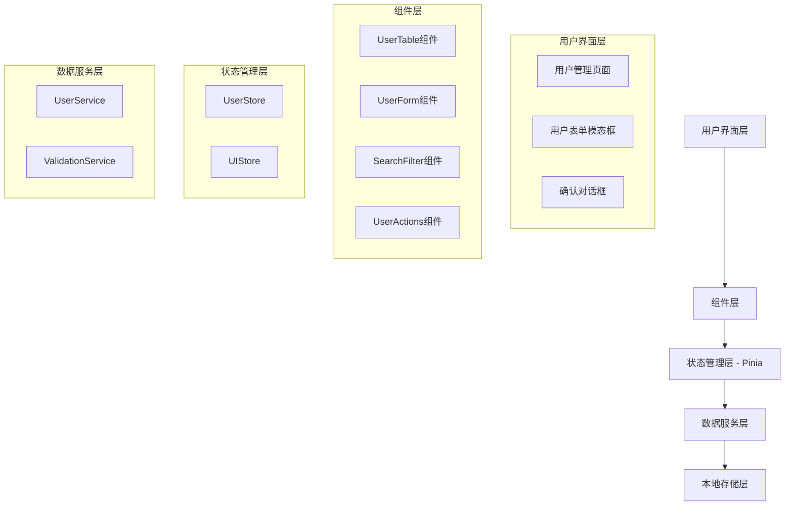

# 设计文档

## 概述

用户管理系统是一个基于Vue 3 Composition API和Ant Design Vue 4.x的现代化前端应用程序。系统采用组件化架构，使用Pinia进行状态管理，TypeScript提供类型安全，Vite作为构建工具。设计重点关注用户体验、代码可维护性和性能优化。

## 架构

### 整体架构



### 技术栈架构

- **前端框架**: Vue 3 (Composition API)
- **UI组件库**: Ant Design Vue 4.x
- **类型系统**: TypeScript
- **状态管理**: Pinia
- **构建工具**: Vite
- **样式方案**: CSS Modules + Ant Design主题

## 组件和接口

### 核心组件设计

#### 1. UserManagement (主容器组件)

```typescript
// UserManagement.vue
interface UserManagementProps {}

interface UserManagementEmits {}

// 组合式API结构
const useUserManagement = () => {
  const userStore = useUserStore()
  const uiStore = useUIStore()
  
  return {
    users: computed(() => userStore.filteredUsers),
    loading: computed(() => uiStore.loading),
    showModal: computed(() => uiStore.showUserModal),
    // 操作方法
    handleAddUser: () => void,
    handleEditUser: (user: User) => void,
    handleDeleteUser: (userId: string) => void,
  }
}
```

#### 2. UserTable (用户列表组件)

```typescript
// UserTable.vue
interface UserTableProps {
  users: User[]
  loading: boolean
}

interface UserTableEmits {
  edit: [user: User]
  delete: [userId: string]
}

// 表格列配置
const columns = [
  { title: '姓名', dataIndex: 'name', key: 'name' },
  { title: '邮箱', dataIndex: 'email', key: 'email' },
  { title: '角色', dataIndex: 'role', key: 'role' },
  { title: '状态', dataIndex: 'status', key: 'status' },
  { title: '创建时间', dataIndex: 'createdAt', key: 'createdAt' },
  { title: '操作', key: 'actions' }
]
```

#### 3. UserForm (用户表单组件)

```typescript
// UserForm.vue
interface UserFormProps {
  visible: boolean
  user?: User | null
  mode: 'create' | 'edit'
}

interface UserFormEmits {
  submit: [userData: CreateUserData | UpdateUserData]
  cancel: []
}

// 表单验证规则
const formRules = {
  name: [
    { required: true, message: '请输入用户姓名' },
    { min: 2, max: 50, message: '姓名长度应在2-50个字符之间' }
  ],
  email: [
    { required: true, message: '请输入邮箱地址' },
    { type: 'email', message: '请输入有效的邮箱地址' }
  ],
  role: [
    { required: true, message: '请选择用户角色' }
  ]
}
```

#### 4. SearchFilter (搜索筛选组件)

```typescript
// SearchFilter.vue
interface SearchFilterProps {}

interface SearchFilterEmits {
  search: [keyword: string]
  filter: [filters: UserFilters]
  reset: []
}

interface UserFilters {
  role?: string
  status?: string
}
```

### 接口定义

#### 用户数据接口

```typescript
// types/user.ts
interface User {
  id: string
  name: string
  email: string
  role: UserRole
  status: UserStatus
  createdAt: string
  updatedAt: string
}

enum UserRole {
  ADMIN = 'admin',
  USER = 'user',
  MODERATOR = 'moderator'
}

enum UserStatus {
  ACTIVE = 'active',
  INACTIVE = 'inactive',
  PENDING = 'pending'
}

interface CreateUserData {
  name: string
  email: string
  role: UserRole
  status: UserStatus
}

interface UpdateUserData extends Partial<CreateUserData> {
  id: string
}
```

#### API响应接口

```typescript
// types/api.ts
interface ApiResponse<T> {
  success: boolean
  data: T
  message?: string
  error?: string
}

interface PaginatedResponse<T> {
  items: T[]
  total: number
  page: number
  pageSize: number
}
```

## 数据模型

### Pinia Store设计

#### UserStore (用户数据存储)

```typescript
// stores/userStore.ts
interface UserState {
  users: User[]
  currentUser: User | null
  searchKeyword: string
  filters: UserFilters
  pagination: {
    current: number
    pageSize: number
    total: number
  }
}

const useUserStore = defineStore('user', () => {
  const state = reactive<UserState>({
    users: [],
    currentUser: null,
    searchKeyword: '',
    filters: {},
    pagination: {
      current: 1,
      pageSize: 10,
      total: 0
    }
  })

  // 计算属性
  const filteredUsers = computed(() => {
    return state.users.filter(user => {
      const matchesSearch = user.name.includes(state.searchKeyword) || 
                           user.email.includes(state.searchKeyword)
      const matchesRole = !state.filters.role || user.role === state.filters.role
      const matchesStatus = !state.filters.status || user.status === state.filters.status
      
      return matchesSearch && matchesRole && matchesStatus
    })
  })

  // 操作方法
  const addUser = (userData: CreateUserData) => {
    const newUser: User = {
      id: generateId(),
      ...userData,
      createdAt: new Date().toISOString(),
      updatedAt: new Date().toISOString()
    }
    state.users.push(newUser)
    saveToLocalStorage()
  }

  const updateUser = (userData: UpdateUserData) => {
    const index = state.users.findIndex(user => user.id === userData.id)
    if (index !== -1) {
      state.users[index] = {
        ...state.users[index],
        ...userData,
        updatedAt: new Date().toISOString()
      }
      saveToLocalStorage()
    }
  }

  const deleteUser = (userId: string) => {
    const index = state.users.findIndex(user => user.id === userId)
    if (index !== -1) {
      state.users.splice(index, 1)
      saveToLocalStorage()
    }
  }

  const setSearchKeyword = (keyword: string) => {
    state.searchKeyword = keyword
  }

  const setFilters = (filters: UserFilters) => {
    state.filters = { ...filters }
  }

  const loadFromLocalStorage = () => {
    const saved = localStorage.getItem('user-management-data')
    if (saved) {
      const data = JSON.parse(saved)
      state.users = data.users || []
    }
  }

  const saveToLocalStorage = () => {
    localStorage.setItem('user-management-data', JSON.stringify({
      users: state.users
    }))
  }

  return {
    // 状态
    users: readonly(state.users),
    currentUser: readonly(state.currentUser),
    searchKeyword: readonly(state.searchKeyword),
    filters: readonly(state.filters),
    pagination: readonly(state.pagination),
    // 计算属性
    filteredUsers,
    // 方法
    addUser,
    updateUser,
    deleteUser,
    setSearchKeyword,
    setFilters,
    loadFromLocalStorage,
    saveToLocalStorage
  }
})
```

#### UIStore (界面状态存储)

```typescript
// stores/uiStore.ts
interface UIState {
  loading: boolean
  showUserModal: boolean
  userModalMode: 'create' | 'edit'
  showDeleteConfirm: boolean
  deleteUserId: string | null
}

const useUIStore = defineStore('ui', () => {
  const state = reactive<UIState>({
    loading: false,
    showUserModal: false,
    userModalMode: 'create',
    showDeleteConfirm: false,
    deleteUserId: null
  })

  const setLoading = (loading: boolean) => {
    state.loading = loading
  }

  const openUserModal = (mode: 'create' | 'edit') => {
    state.showUserModal = true
    state.userModalMode = mode
  }

  const closeUserModal = () => {
    state.showUserModal = false
  }

  const openDeleteConfirm = (userId: string) => {
    state.showDeleteConfirm = true
    state.deleteUserId = userId
  }

  const closeDeleteConfirm = () => {
    state.showDeleteConfirm = false
    state.deleteUserId = null
  }

  return {
    // 状态
    loading: readonly(state.loading),
    showUserModal: readonly(state.showUserModal),
    userModalMode: readonly(state.userModalMode),
    showDeleteConfirm: readonly(state.showDeleteConfirm),
    deleteUserId: readonly(state.deleteUserId),
    // 方法
    setLoading,
    openUserModal,
    closeUserModal,
    openDeleteConfirm,
    closeDeleteConfirm
  }
})
```

### 数据服务层

#### UserService (用户数据服务)

```typescript
// services/userService.ts
class UserService {
  private static instance: UserService
  
  static getInstance(): UserService {
    if (!UserService.instance) {
      UserService.instance = new UserService()
    }
    return UserService.instance
  }

  async validateUser(userData: CreateUserData | UpdateUserData): Promise<ValidationResult> {
    const errors: string[] = []
    
    // 邮箱格式验证
    if (!this.isValidEmail(userData.email)) {
      errors.push('邮箱格式不正确')
    }
    
    // 邮箱唯一性验证（编辑时排除当前用户）
    if (this.isEmailExists(userData.email, 'id' in userData ? userData.id : undefined)) {
      errors.push('邮箱已存在')
    }
    
    return {
      isValid: errors.length === 0,
      errors
    }
  }

  private isValidEmail(email: string): boolean {
    const emailRegex = /^[^\s@]+@[^\s@]+\.[^\s@]+$/
    return emailRegex.test(email)
  }

  private isEmailExists(email: string, excludeId?: string): boolean {
    const userStore = useUserStore()
    return userStore.users.some(user => 
      user.email === email && user.id !== excludeId
    )
  }

  generateId(): string {
    return Date.now().toString(36) + Math.random().toString(36).substr(2)
  }
}

interface ValidationResult {
  isValid: boolean
  errors: string[]
}
```

## 错误处理

### 错误类型定义

```typescript
// types/error.ts
enum ErrorType {
  VALIDATION_ERROR = 'VALIDATION_ERROR',
  NETWORK_ERROR = 'NETWORK_ERROR',
  STORAGE_ERROR = 'STORAGE_ERROR',
  UNKNOWN_ERROR = 'UNKNOWN_ERROR'
}

interface AppError {
  type: ErrorType
  message: string
  details?: any
}
```

### 错误处理策略

1. **表单验证错误**: 在表单字段下方显示具体错误信息
2. **操作失败错误**: 使用Ant Design的message组件显示错误提示
3. **网络错误**: 显示重试选项和错误详情
4. **存储错误**: 提供数据恢复选项

### 全局错误处理

```typescript
// composables/useErrorHandler.ts
export const useErrorHandler = () => {
  const handleError = (error: AppError) => {
    switch (error.type) {
      case ErrorType.VALIDATION_ERROR:
        // 表单验证错误由表单组件处理
        break
      case ErrorType.NETWORK_ERROR:
        message.error('网络连接失败，请检查网络设置')
        break
      case ErrorType.STORAGE_ERROR:
        message.error('数据保存失败，请重试')
        break
      default:
        message.error('操作失败，请重试')
    }
  }

  return { handleError }
}
```

## 测试策略

### 测试方法概述

用户管理系统采用双重测试策略：

- **单元测试**: 验证具体示例、边界情况和错误条件
- **属性测试**: 验证跨所有输入的通用属性

单元测试专注于特定示例和集成点，而属性测试通过随机化提供全面的输入覆盖。两者相辅相成，确保全面覆盖（单元测试捕获具体错误，属性测试验证通用正确性）。

### 属性测试配置

- **测试库**: 使用fast-check进行属性测试
- **最小迭代次数**: 每个属性测试100次迭代（由于随机化）
- **标签格式**: **Feature: user-management-system, Property {number}: {property_text}**
- **测试映射**: 每个正确性属性必须由单个属性测试实现

### 测试覆盖范围

- **组件测试**: 验证Vue组件的渲染和交互
- **Store测试**: 验证Pinia状态管理的正确性
- **服务测试**: 验证业务逻辑和数据处理
- **集成测试**: 验证组件间的协作

## 正确性属性

*属性是一个特征或行为，应该在系统的所有有效执行中保持为真——本质上是关于系统应该做什么的正式声明。属性作为人类可读规范和机器可验证正确性保证之间的桥梁。*

基于需求分析和预工作评估，以下属性确保用户管理系统的正确性：

### 属性 1: 用户列表渲染完整性
*对于任何* 用户数据集合，当系统渲染用户列表时，Table组件应该显示所有用户记录，并包含姓名、邮箱、角色、状态和创建时间列
**验证需求: 需求 1.1, 1.2**

### 属性 2: 分页功能触发
*对于任何* 超过10条记录的用户数据集合，系统应该自动启用分页功能
**验证需求: 需求 1.4**

### 属性 3: 用户数据CRUD操作一致性
*对于任何* 有效的用户数据操作（创建、更新、删除），操作完成后用户列表应该正确反映数据变化，且操作的用户记录应该在列表中正确显示或移除
**验证需求: 需求 2.2, 3.2, 4.2**

### 属性 4: 表单验证综合性
*对于任何* 用户输入数据，表单验证应该正确验证邮箱格式、必填字段非空、用户名唯一性，并在验证失败时显示相应错误信息，在验证通过时启用提交按钮
**验证需求: 需求 7.1, 7.2, 7.3, 7.4, 7.5**

### 属性 5: 无效输入拒绝
*对于任何* 无效的用户输入数据，系统应该拒绝提交并显示验证错误信息，保持原有数据状态不变
**验证需求: 需求 2.3, 3.3**

### 属性 6: 编辑预填充正确性
*对于任何* 用户记录，点击编辑时打开的表单应该预填充该用户的当前信息
**验证需求: 需求 3.1**

### 属性 7: 搜索和筛选功能
*对于任何* 搜索关键词或筛选条件（角色、状态），系统返回的结果应该只包含匹配条件的用户记录
**验证需求: 需求 5.1, 5.2, 5.3**

### 属性 8: 状态管理同步性
*对于任何* 用户数据变化，Pinia store应该正确更新应用状态，所有访问该数据的组件应该获得一致的、同步更新的数据
**验证需求: 需求 6.1, 6.3, 6.4**

### 属性 9: 数据持久化往返
*对于任何* 用户数据，保存到本地存储后再加载应该得到相同的数据结构和内容
**验证需求: 需求 6.2**

### 属性 10: 操作反馈一致性
*对于任何* 用户操作完成（成功或失败），系统应该显示相应的Toast消息提供及时反馈
**验证需求: 需求 8.5**